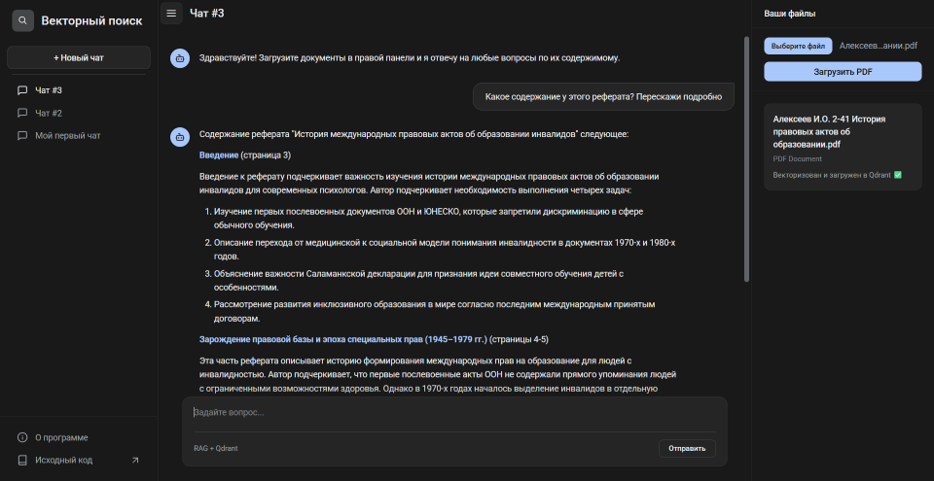

# Векторный RAG чат

<p align="center">

</p>

<p align="center">
Self-hosted RAG-чат для работы с PDF-документами: загружайте файлы, индексируйте их в Qdrant и задавайте вопросы на русском языке.
Проект рассчитан на локальный или контейнерный запуск, поэтому его удобно использовать в учебной практике, на демо и в собственном контуре.
</p>

<p align="center">


</p>

## О проекте

Это учебный Open Source-проект в формате self-hosted приложения. Он объединяет загрузку PDF, векторный поиск по содержимому и генерацию ответов через LLM в одном простом веб-интерфейсе.

Пользователь выбирает чат, загружает в него один или несколько PDF-файлов и задаёт вопрос. Система разбивает документы на фрагменты, строит эмбеддинги, сохраняет их в Qdrant и затем подаёт только релевантные куски контекста в языковую модель.

### Что умеет приложение

- Создавать несколько чатов и хранить их историю в SQLite.
- Загружать PDF-файлы в конкретный чат.
- Индексировать документы в Qdrant с привязкой к `chat_id`.
- Искать релевантные фрагменты по вопросу пользователя.
- Отвечать на русском языке с опорой на загруженный контекст.
- Работать в self-hosted режиме без привязки к стороннему веб-сервису интерфейса.

### Как это работает

1. Пользователь создаёт чат и загружает в него PDF.
2. Файл парсится, режется на чанки и преобразуется в векторы через Sentence Transformers.
3. Векторы и метаданные сохраняются в Qdrant, а имя файла фиксируется в SQLite.
4. При вопросе система ищет релевантные фрагменты только внутри выбранного чата.
5. Языковая модель получает контекст и формирует ответ по найденным данным.

## Технологический стек

- FastAPI для веб-приложения и HTTP-роутов.
- Jinja2 и HTMX для серверного интерфейса.
- Tailwind CSS и Basecoat UI для стилизации фронтенда.
- SQLite для истории чатов, сообщений и списка файлов.
- Qdrant для векторного поиска.
- Sentence Transformers для эмбеддингов.
- OpenAI-compatible API для генерации ответов.
- Docker и Docker Compose для развёртывания.

## Структура проекта

```text
rag-vector-chat/
├── data/
│   └── chat_history.db
├── src/
│   ├── chat/
│   │   ├── models.py
│   │   ├── router.py
│   │   ├── schemas.py
│   │   └── service.py
│   ├── documents/
│   │   ├── router.py
│   │   ├── service.py
│   │   └── utils.py
│   ├── templates/
│   │   ├── index.html
│   │   └── partials/
│   │       ├── chat_workspace.html
│   │       ├── document_card.html
│   │       ├── document_list_items.html
│   │       ├── message_pair.html
│   │       ├── new_chat_response.html
│   │       └── sidebar_chats.html
│   ├── config.py
│   ├── database.py
│   └── main.py
├── Dockerfile
├── docker-compose.yml
├── pyproject.toml
└── README.md
```

## Требования

- Python 3.11 или новее для локального запуска.
- Docker и Docker Compose для контейнерного запуска.
- Доступ к OpenAI-compatible API или совместимому провайдеру.
- Свободный порт `8000` для приложения и `6333` для Qdrant.

## Настройка окружения

Создайте файл `.env` в корне проекта и задайте параметры ниже:

```env
ENVIRONMENT=local
QDRANT_URL=http://localhost:6333
LLM_API_KEY=ваш_ключ_доступа
LLM_BASE_URL=https://api.groq.com/openai/v1
LLM_MODEL_NAME=llama-3.1-8b-instant
DATABASE_URL=sqlite+aiosqlite:///./data/chat_history.db
```

Если вы используете Docker Compose из этого репозитория, значение `QDRANT_URL` можно оставить без изменений: сервис уже поднимается внутри одной сети.

## Быстрый старт

### 1. Клонируйте репозиторий

```bash
git clone https://github.com/IgorAlekseev-dev/rag-vector-chat
cd rag-vector-chat
```

### 2. Подготовьте виртуальное окружение и зависимости

Рекомендуемый вариант для локальной разработки:

```bash
uv venv
uv pip install -r pyproject.toml
```

### 3. Запустите Qdrant и приложение локально

Сначала поднимите только векторную базу:

```bash
docker compose up -d qdrant
```

Затем запустите FastAPI-приложение:

```bash
uvicorn src.main:app --reload --host 0.0.0.0 --port 8000
```

Откройте браузер и перейдите по адресу `http://127.0.0.1:8000`.

## Запуск через Docker Compose

Если хотите поднять всё приложение целиком в контейнерах, используйте одну команду:

```bash
docker compose up --build
```

После сборки будут запущены и приложение, и Qdrant.

### Остановка контейнеров

```bash
docker compose down -v
```

Опция `-v` удаляет тома, поэтому вместе с контейнерами очищается и хранилище Qdrant.

## Полезные команды

### Логи

```bash
docker compose logs -f
```

### Проверка запущенных сервисов

```bash
docker compose ps
```

### Пересборка без кэша

```bash
docker compose build --no-cache
```

### Остановка только приложения при локальном запуске

```text
Ctrl + C
```

## API и основные маршруты

Для разработчиков и тех, кто хочет быстро понять внутреннюю логику, в проекте есть следующие маршруты:

- `GET /` — главная страница с активным чатом.
- `POST /chat/new` — создание нового чата.
- `GET /chat/{chat_id}` — открытие конкретного чата.
- `POST /chat/{chat_id}/message` — отправка сообщения в чат.
- `POST /documents/{chat_id}/upload` — загрузка PDF в выбранный чат.

## Архитектурные заметки

- История чатов, сообщений и загруженных файлов хранится в SQLite, чтобы проект был лёгким и автономным.
- Векторные данные лежат в Qdrant и фильтруются по `chat_id`, поэтому ответы не смешиваются между чатами.
- Модель эмбеддингов `intfloat/multilingual-e5-small` используется для построения поисковых векторов.
- Ответы формируются через OpenAI-compatible клиент, поэтому при желании провайдера можно заменить без перестройки интерфейса.
- Интерфейс собран на серверной рендеринг-модели, что делает проект понятным и простым для поддержки.

## Для разработчиков

Если вы хотите доработать проект, обычно удобно идти по следующим направлениям:

- расширить поддержку форматов документов;
- добавить стриминг ответа токенами;
- подключить авторизацию пользователей;
- вынести конфигурацию провайдера LLM в более явный профиль;
- добавить тесты на маршруты и сервисный слой;

## Лицензия

Проект распространяется под лицензией [MIT](LICENSE). Это означает, что вы можете свободно использовать, копировать, изменять и распространять код при сохранении текста лицензии и уведомления об авторстве.